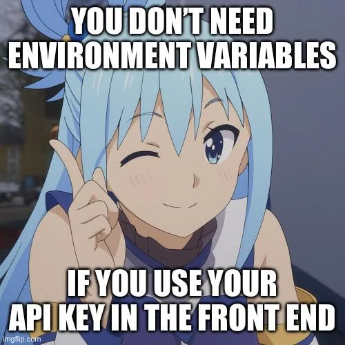

  

  

  
  
  
  
  
  

  

---

<table>
<tr>
<td width="60%" valign="top">

### 👩‍💻 About Me

- 🔭 I'm currently working on **Placement Buddy (PIA)** — a RAG-based placement intelligence assistant
- 🌱 I'm currently learning **Full-Stack Development**
- ⛓️ I collaborate on **blockchain-based** projects on the side
- 📫 How to reach me: **krupaintros@gmail.com**
- 📍 Based in **Bengaluru**

</td>
<td width="40%" valign="top">

</td>
</tr>
</table>

---

### 📘 Featured Projects

| Project | Description | My Role |
|---|---|---|
| 🤖 [Placement Buddy (PIA)](https://github.com/bks717/Placement-Intelligence-Assistant-PIA--RAG) | RAG-based Placement Intelligence Assistant | Creator |
| ⛓️ [AXIOS — Blockchain Principle-Based Ledger](https://github.com/BhuvanSShetty/AXIOS---A-Blockchain-Principle-Based-Ledger) | A blockchain-based ledger system | Collaborator |
| 🌪️ [mp-latest](https://github.com/bks717/mp-latest) | ML-based Disaster Prediction System (Major Project, Python + ML) | Creator |
| 🎟️ [BlockSeat](https://github.com/HMAjay/BlockSeat) | RCB website reconstructed with blockchain-based seating | Contributor |

---

## 🧰 Tech Stack

**Languages**

**Frontend**

**Backend & Databases**

**Tools & Design**

---

### 📊 GitHub Stats & Activity

  
  

  

  

---

<i>Thanks for stopping by! Feel free to explore my repos and connect with me above 🚀</i>

